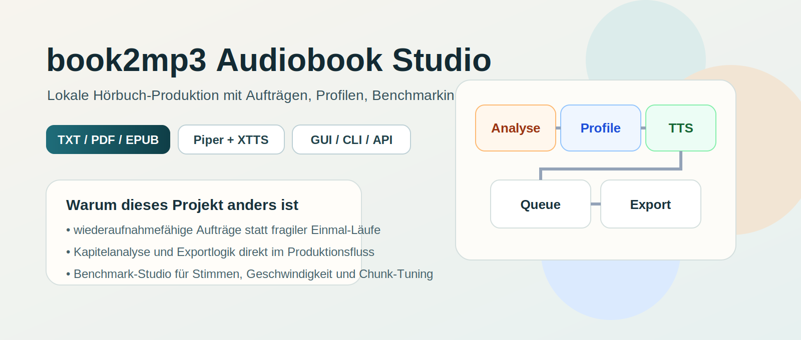
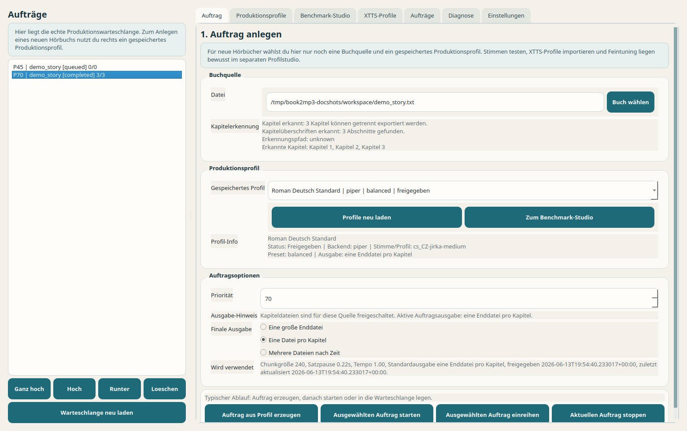
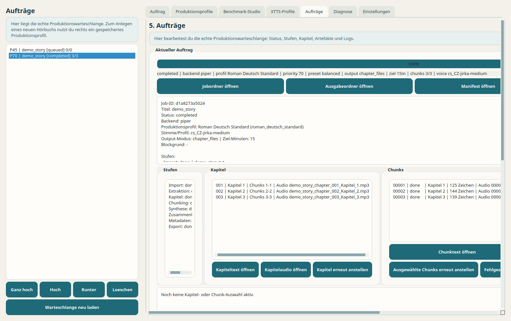
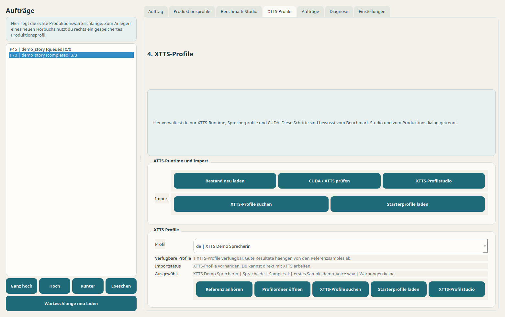
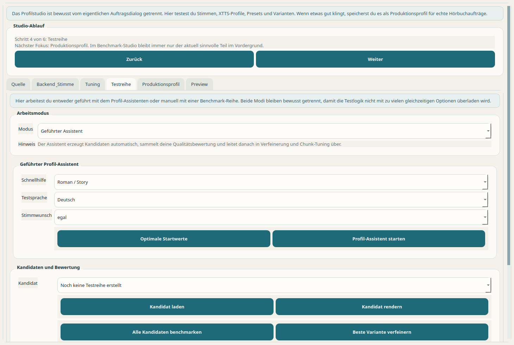
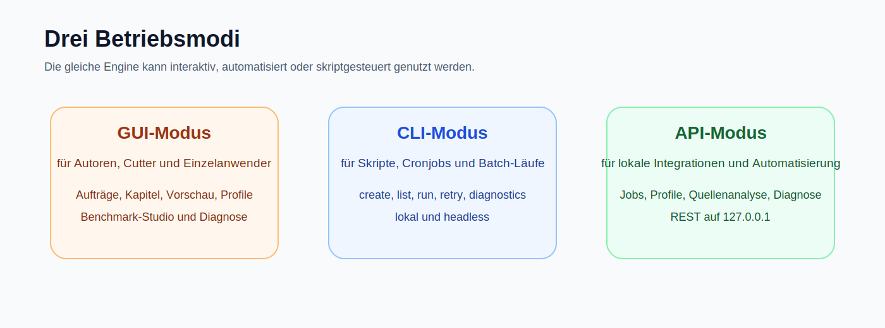

# book2mp3 Audiobook Studio

Lokale Hörbuch-Produktion aus `TXT`, `PDF` und `EPUB` mit wiederaufnahmefähigen Aufträgen, Profilen, Benchmarking und sauberem MP3-Export.



`book2mp3` ist für echte Buchprojekte gebaut, nicht für einen fragilen Einmal-Klick.  
Die Software trennt bewusst zwischen Quelle, Kapitelanalyse, Profilen, Testreihen, Queue und Export.

## Was das Projekt besonders macht

- wiederaufnahmefähige Aufträge statt monolithischer TTS-Läufe
- Kapitel- und Chunk-Artefakte, die einzeln prüf- und neu startbar sind
- Produktionsprofile mit Freigabestatus statt unkontrollierter Einzelsettings
- Benchmark-Studio für Stimmen, Geschwindigkeit und Chunk-Tuning
- gleicher Kern für GUI, CLI und lokale API

## Screenshots

### Hauptfenster



### Auftragszentrale



### XTTS-Profile



### Benchmark-Studio



## Betriebsmodi



| Modus | Wofür er gedacht ist |
| --- | --- |
| GUI | Produktionsarbeit mit Aufträgen, Profilen, Queue, Kapitel- und Chunkkontrolle |
| CLI | Skripte, Cronjobs, Batch-Läufe, Diagnosen und lokale Automatisierung |
| API | lokale Integrationen über REST auf `127.0.0.1` |

## Verarbeitungspipeline


## Typischer Arbeitsfluss

1. Quelle wählen
2. Kapitelanalyse abwarten
3. freigegebenes Produktionsprofil laden
4. Ausgabeart festlegen
5. Auftrag starten oder einreihen
6. Fortschritt, Kapitel und Chunks in `Aufträge` überwachen
7. Exportdateien und Metadaten prüfen

## Kernfunktionen

- Import von `TXT`, `PDF` und `EPUB`
- automatische Kapitelanalyse mit klarer Rückmeldung
- Ausgabe als Gesamtdatei, Kapiteldateien oder Zeitteile
- lokale Piper-Stimmen und optionaler XTTS-Pfad
- UI und kuratierte Sprachpfade für Deutsch, Englisch, Spanisch und Portugiesisch
- Produktionsprofile mit `draft`, `tested`, `approved`, `archived`
- Benchmarking von Varianten, Geschwindigkeit und Chunk-Größen
- Queue, Prioritäten und Wiederaufnahme
- `manifest.json` und `chapters.json` für nachvollziehbare Exporte
- lokaler GUI-, CLI- und API-Betrieb mit gemeinsamem Kern

## Schnellstart

Für ein fertiges Endnutzer-Bundle gilt:

- `Piper` ist sofort nutzbar
- `XTTS` bleibt optional
- Python muss nicht separat installiert werden
- im Bundle liegt zusätzlich eine `START_HERE.md` mit dem Endnutzerpfad

Start unter Linux:

```bash
./start.sh
```

Start unter Windows:

```bat
start.bat
```

Optionale XTTS-Einrichtung im Bundle:

```bash
./start.sh --install-xtts
```

oder unter Windows:

```bat
start.bat --install-xtts
```

Die App bietet denselben XTTS-Setup auch direkt im Bereich `XTTS-Profile` und in `Diagnose` an.  
Wichtig: Der bequeme Downloadpfad verbessert nur die Benutzbarkeit. Die XTTS-Modelllizenz wird dadurch nicht automatisch für öffentliche oder kommerzielle Nutzung freigegeben.

Für Quellcode-Entwicklung bleibt der Repo-Checkout-Pfad:

```bash
python3 -m venv .venv
source .venv/bin/activate
pip install -e .
python scripts/bootstrap_runtime.py
book2mp3
```

On Windows, activate the virtual environment with:

```powershell
.venv\Scripts\Activate.ps1
```

Then run:

```powershell
pip install -e .
python scripts\bootstrap_runtime.py
book2mp3
```

For headless local automation:

```bash
book2mp3-cli list
book2mp3-cli voices
book2mp3-cli profiles
book2mp3-cli profile-status mein_profil approved
book2mp3-cli diagnostics
book2mp3-cli create /path/to/book.txt --profile-id mein_profil --language de
book2mp3-cli run-next
book2mp3-cli serve --host 127.0.0.1 --port 8765
```

The default starter pack is intentionally multilingual and includes curated German, English, Spanish and Portuguese voices in addition to the German defaults.

## Projektstruktur

- `src/book2mp3/`: Anwendungscode
- `docs/`: Startseite, Quickstarts, Architektur- und Release-Doku
- `scripts/bootstrap_runtime.py`: lokale Runtime- und Stimmenbeschaffung
- `ebooksp/`: ältere Referenzskripte

## Packaging direction

The intended packaging target is folder-based desktop deployment, not a single giant executable. The portable release must include app-local Python:

- Windows: `pyside6-deploy` / Nuitka one-folder
- Linux: `pyside6-deploy` / Nuitka one-folder
- runtime assets stored next to the app in `runtime/` and `voices/`
- bundled Python stored in `python/<platform>/`

That fits the toolchain constraints better than a one-file build and keeps large TTS assets replaceable by the user.

## Release- und Lizenzstatus

Der Quellcode dieses Repos ist veröffentlichbar. Für ein öffentliches Release-Bundle müssen aber weiterhin Drittkomponenten sauber behandelt werden, besonders:

- `EbookLib`
- `XTTS-v2`
- `FFmpeg`
- gebündelte Piper-Stimmen

Portable Builds:

- Linux- und Windows-Portables werden bei Push auf `main` als rolling Pre-Release gebaut
- Standardpfad ist `Piper-ready`
- XTTS bleibt im Release bewusst optional und separat gekennzeichnet

Details:

- [Open-Source and Release Check](docs/open-source-compliance.md)
- [Third-Party Notices](THIRD_PARTY_NOTICES.md)

## Documentation

- [GitHub Pages Landing Page](docs/index.md)
- [Project Description](docs/project-description.md)
- [Quickstart: Source Checkout](docs/quickstart-source.md)
- [Quickstart: First Audiobook](docs/quickstart-first-audiobook.md)
- [Quickstart: Portable Bundle](docs/quickstart-portable.md)
- [Open-Source and Release Check](docs/open-source-compliance.md)
- [User Guide](docs/user-guide.md)
- [Architecture](docs/architecture.md)
- [Requirements V1](docs/anforderungen-book2mp3-v1.md)
- [Portable Distribution](docs/portable-distribution.md)
- [Release Checklist](docs/release-checklist.md)
- [Roadmap](docs/roadmap.md)
- [Voice Strategy](docs/voice-strategy.md)
- [Next Agent Handover](docs/next-agent.md)
- [Third-Party Notices](THIRD_PARTY_NOTICES.md)

## Smoke test

For a queue and resume smoke test without the GUI:

```bash
python scripts/smoke_queue_resume.py
```

For a voice-tuning session smoke test:

```bash
python scripts/smoke_preview_session.py
```

Additional targeted smoke tests:

```bash
python scripts/smoke_single_file.py
python scripts/smoke_state_migration.py
python scripts/smoke_preview_queue.py
python scripts/smoke_bundle_build.py
python scripts/smoke_portable_linux_runtime.py
python scripts/smoke_linux_release_build.py
python scripts/smoke_xtts_job_model.py
python scripts/smoke_xtts_linux_runtime_bootstrap.py
python scripts/smoke_cli_flow.py
python scripts/smoke_local_api.py
```

Current validated smoke coverage:

- queue stop/resume flow
- voice-tuning session persistence, saved settings and preview render flow
- `single_file` MP3 output
- legacy `state.json` migration
- preview queue ordering

To validate a built portable bundle:

```bash
python scripts/check_portable_bundle.py /path/to/bundle
```

To assemble a portable bundle skeleton:

```bash
python scripts/build_portable_bundle.py dist/book2mp3-portable --clean
```

To turn that into a local Linux self-contained bundle from the current machine:

```bash
python scripts/populate_bundle_python_linux.py dist/book2mp3-portable
```

To install XTTS directly into that portable app Python too:

```bash
python scripts/install_xtts_into_bundle_python.py dist/book2mp3-portable
```

Or do the larger Linux release step in one command:

```bash
python scripts/build_linux_portable_release.py dist/book2mp3-linux-portable --archive
```

If XTTS should be available directly inside the portable app Python, build with:

```bash
python scripts/build_linux_portable_release.py dist/book2mp3-linux-portable --include-xtts-in-app-python --archive
```

To bootstrap the optional Linux XTTS runtime with a dedicated standalone Python 3.11:

```bash
python scripts/setup_xtts_runtime.py runtime/xtts/linux --bootstrap-linux-standalone
```

This setup now prefers CPU Torch wheels by default so the portable runtime does not accidentally pull the full CUDA stack.

If you want XTTS to try CUDA on NVIDIA systems, use:

```bash
python scripts/setup_xtts_runtime.py runtime/xtts/linux --bootstrap-linux-standalone --torch-variant auto
```

The runtime now probes CUDA after install and reports whether it actually worked.

To make the local `src/` program folder itself self-contained on Linux, populate the embedded app Python directly:

```bash
python scripts/populate_bundle_python_linux.py src
```

After that, `src/start.sh` and `src/book2mp3/start.sh` start with `src/python/linux/` and no longer need a local system Python.

To prepare the local `src/` program folder for Windows as well, including the official embeddable Python and unpacked `win_amd64` dependency wheels:

```bash
python scripts/populate_bundle_python_windows.py src --clean
```

As verified on April 21, 2026, the default Windows embeddable source used by that script is:

```text
https://www.python.org/ftp/python/3.13.13/python-3.13.13-embeddable-amd64.zip
```
