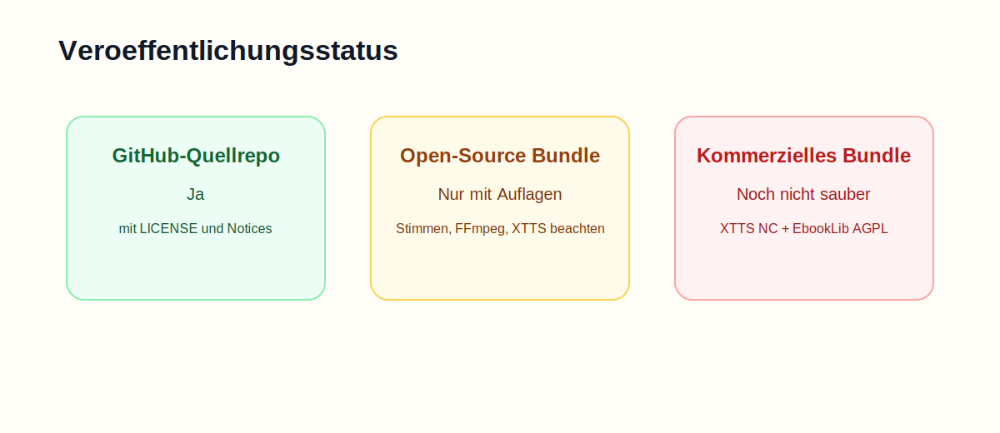

# Open-Source- und Release-Check

Diese Datei ist eine technische Compliance-Einschaetzung und keine Rechtsberatung.

## Kurzfazit

### Was heute sauber moeglich ist

- den Quellcode auf GitHub veroeffentlichen
- die eigene Projektlogik unter einer Open-Source-Lizenz veroeffentlichen
- die Dokumentation und Build-Skripte oeffentlich machen

### Was heute **nicht** als unproblematische Release-Verteilung gilt

- ein kommerzielles XTTS-Bundle `as is`
- ein unkommentiertes Binary-Bundle mit FFmpeg, Stimmen und XTTS-Modell ohne saubere Lizenzbeipackzettel
- eine Release-Aussage wie `alles frei und ohne Zusatzpflichten verteilbar`

## Komponenteneinschaetzung

| Komponente | Quelle / Lizenz | Einschaetzung |
| --- | --- | --- |
| `book2mp3` Eigenquellcode | dieses Repo, `MIT` | fuer den Eigenquellcode unkritisch |
| PySide6 / Qt for Python | LGPLv3/GPL/commercial | veroeffentlichbar, aber Lizenz- und Weitergabepflichten beachten |
| Beautiful Soup 4 | MIT | unkritisch |
| pypdf | BSD-3-Clause | unkritisch |
| requests | Apache-2.0 | unkritisch |
| imageio-ffmpeg Wrapper | BSD-2-Clause | unkritisch als Python-Bibliothek |
| Python Runtime | PSF-2.0 | unkritisch mit Lizenzbeileger |
| Piper Engine | MIT | unkritisch |
| Piper Voices | Hugging Face Repo MIT, einzelne Stimmen mit eigenen `MODEL_CARD`-Hinweisen | nur mit Modellkarten und Attributionspruefung sauber bundeln |
| EbookLib | AGPL-3.0 | fuer eine Bundle-Distribution ein echter juristischer Punkt |
| Coqui TTS Toolkit | MPL-2.0 | fuer den Code selbst grundsaetzlich brauchbar |
| XTTS-v2 Modell | Coqui Public Model License 1.0.0 | laut offizieller Lizenz nur nicht-kommerziell |
| XTTS Startersamples aus `xtts-webui` | MIT-Repo, Samples aus Upstream-Ordner | Herkunft und Beipackzettel mitfuehren |
| Thorsten-Voice Dataset | CC0 | grundsaetzlich gut nutzbar |
| FFmpeg Binary im Bundle | haeufig GPLv3-Builds | Bundle nur mit GPL-konformer Weitergabe und Notices |

## Offizielle Release-Bewertung

### 1. GitHub-Quellrepo

Ja, das Repo kann mit:

- Projektlizenz
- Third-Party-Hinweisen
- klarer Dokumentation

oeffentlich auf GitHub liegen.

### 2. Open-Source-Release-Bundle fuer Hobby-/Selbsthosting-Nutzung

Moeglich, aber nur mit:

- `THIRD_PARTY_NOTICES.md`
- den relevanten Upstream-Lizenzen
- `MODEL_CARD`-Dateien aller gebuendelten Piper-Stimmen
- XTTS-Modell-Lizenzhinweis
- FFmpeg-Hinweisen

### 3. Kommerzielle oder rechtlich besonders saubere Produktveroeffentlichung

Der aktuelle Stand ist **nicht sauber genug** fuer eine einfache `as-is`-Freigabe, weil mindestens diese Punkte offen sind:

1. `EbookLib` ist AGPL-lizenziert.
2. `XTTS-v2` ist unter `Coqui Public Model License` und laut offizieller Lizenz nicht fuer kommerzielle Nutzung freigegeben.
3. FFmpeg-Binaries koennen GPL-Pflichten ausloesen.
4. die Piper-Stimmen muessen mit ihren jeweiligen `MODEL_CARD`-Hinweisen verteilt werden.

## Empfohlene Schritte fuer eine saubere Release-Linie

1. `EbookLib` durch einen permissiv lizenzierten EPUB-Parser ersetzen oder AGPL bewusst akzeptieren.
2. XTTS im oeffentlichen Standard-Release nur als optionalen, vom Nutzer selbst installierten Pfad behandeln.
3. FFmpeg nicht blind bundeln, sondern den konkreten Binary-Ursprung dokumentieren und die Lizenz mitliefern.
4. Jede gebuendelte Piper-Stimme mit `MODEL_CARD` ausliefern.
5. Fuer GitHub Releases ein kleines Compliance-Paket beilegen:
   - `LICENSE`
   - `THIRD_PARTY_NOTICES.md`
   - `docs/open-source-compliance.md`
   - relevante Upstream-Lizenzdateien

## Quellen

- [Qt for Python / PySide6 auf PyPI](https://pypi.org/project/PySide6/)
- [Qt Open-Source LGPL Obligations](https://www.qt.io/development/open-source-lgpl-obligations)
- [Beautiful Soup Lizenz](https://www.crummy.com/software/BeautifulSoup/)
- [pypdf Lizenz-FAQ](https://pypdf.readthedocs.io/en/stable/meta/faq.html)
- [requests auf PyPI](https://pypi.org/project/requests/)
- [imageio-ffmpeg Lizenz](https://github.com/imageio/imageio-ffmpeg/blob/master/LICENSE)
- [Piper Repository](https://github.com/rhasspy/piper)
- [Piper Voices auf Hugging Face](https://huggingface.co/rhasspy/piper-voices)
- [EbookLib Repository](https://github.com/aerkalov/ebooklib)
- [Coqui TTS Repository](https://github.com/coqui-ai/TTS)
- [XTTS-v2 Modellseite](https://huggingface.co/coqui/XTTS-v2)
- [XTTS-v2 Modelllizenz](https://huggingface.co/coqui/XTTS-v2/blob/main/LICENSE.txt)
- [Thorsten-Voice Dataset](https://huggingface.co/datasets/Thorsten-Voice/TV-44kHz-Full)
- [xtts-webui Repository](https://github.com/daswer123/xtts-webui)
- [Python Lizenz](https://docs.python.org/3/license.html)
- [FFmpeg Download-Seite](https://ffmpeg.org/download.html)
- [John Van Sickle FFmpeg Static Builds](https://johnvansickle.com/ffmpeg/)
