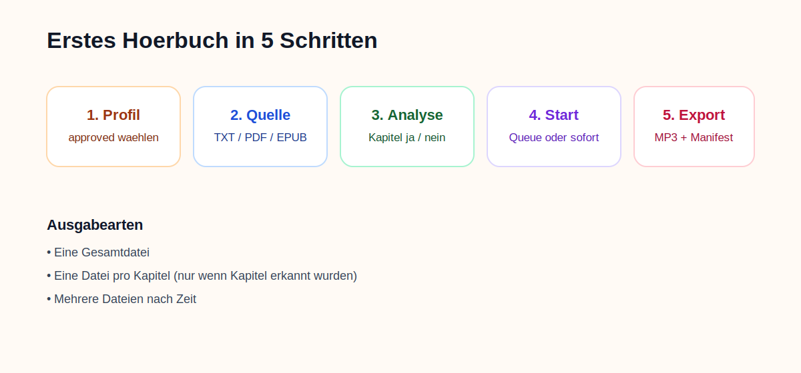

# Quickstart: Erstes Hoerbuch erzeugen

## Ziel

In wenigen Schritten aus einer Datei ein sauberes MP3-Hoerbuch erzeugen.

## 1. Profil waehlen

Oeffne `Produktionsprofile` und waehle ein `approved`-Profil.

Wichtig:

- Der Produktionsdialog arbeitet absichtlich nur mit freigegebenen Profilen.
- Stimmenvergleich, Testreihen und XTTS-Tuning gehoeren ins `Benchmark-Studio`.

## 2. Datei laden

Gehe zu `Neuer Auftrag` und waehle deine Datei:

- `TXT`
- `PDF`
- `EPUB`

Danach startet automatisch die Quellenanalyse.

## 3. Kapitelanalyse verstehen

Die App zeigt nach der Dateiwahl klar an:

- ob Kapitel erkannt wurden
- welcher Erkennungspfad genutzt wurde
- ob `Eine Datei pro Kapitel` erlaubt ist

Moegliche Ausgaben:

- `Eine Gesamtdatei`
- `Eine Datei pro Kapitel`
- `Mehrere Dateien nach Zeit`

Wenn keine Kapitelstruktur erkannt wurde, bleibt `Eine Datei pro Kapitel` sichtbar, aber deaktiviert.

## 4. Metadaten setzen

Pflege nach Bedarf:

- Buchtitel
- Autor
- Sprecher
- Sprache
- Kommentar / Quelle

Diese Informationen werden fuer MP3-Tags und Manifestdateien genutzt.

## 5. Auftrag starten

Waehle:

- `Jetzt starten`, wenn der Auftrag sofort laufen soll
- `In Queue`, wenn spaeter verarbeitet werden soll

## 6. Fortschritt verfolgen

In `Auftraege` kannst du sehen:

- Auftragsstatus
- Stufenstatus
- erkannte Kapitel
- erzeugte Chunks
- Audio-Artefakte
- Retry-Aktionen bei Fehlern

## 7. Ergebnis pruefen

Im Ausgabeordner findest du je nach Modus:

- Kapitel-MP3s
- eine Gesamtdatei
- zeitbasierte Teile
- `manifest.json`
- `chapters.json`

## Wenn du mit der Stimme unzufrieden bist

Nutze `Benchmark-Studio`:

1. Quelle waehlen
2. Backend waehlen
3. Kandidaten hoeren
4. Benchmark messen
5. Chunk-Tuning ausfuehren
6. Gewinner als Produktionsprofil freigeben
