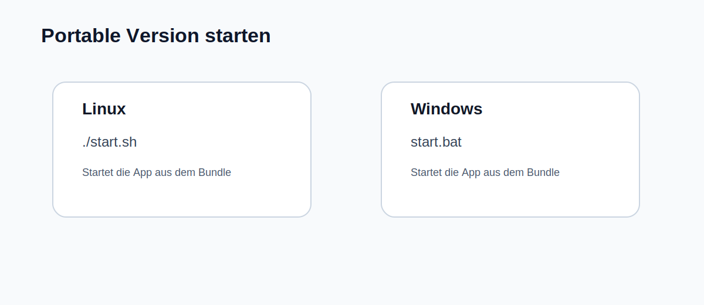

# Quickstart: Portable Version



## Linux

Im fertigen Bundle startest du die App mit:

```bash
./start.sh
```

## Windows

Im fertigen Bundle startest du die App mit:

```bat
start.bat
```

## Erwartetes Bundle-Layout

- `start.sh` / `start.bat`
- `src/`
- `python/<platform>/`
- `runtime/`
- `voices/`
- `workspace/`

## Erststart

Nach dem Start:

1. `Diagnose` oeffnen
2. Runtime- und CUDA-Status pruefen
3. vorhandene Produktionsprofile oder Stimmen pruefen
4. Testauftrag mit kurzer `TXT` ausfuehren

## Typische Fehler

- fehlende Schreibrechte im `workspace`
- nicht vorhandene XTTS-Runtime
- leere Stimmen-/Profilordner

Die App zeigt diese Faelle heute als Diagnose- oder `blocked`-Zustand, statt beim Start hart abzubrechen.
