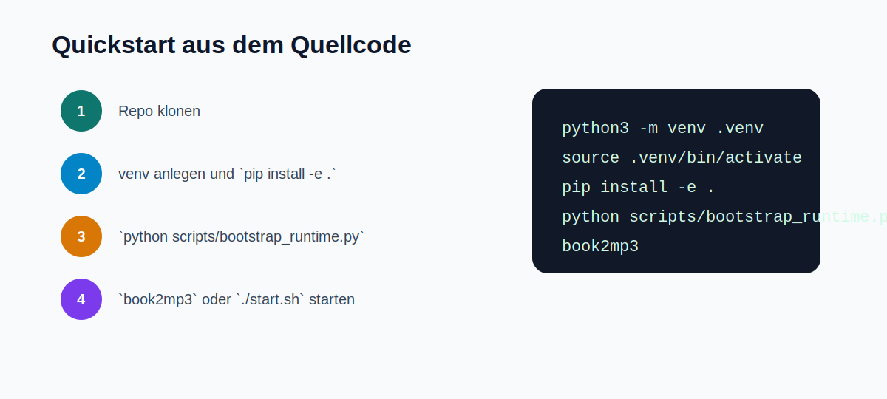

# Quickstart: Entwicklung aus dem Quellcode



## 1. Repo klonen

```bash
git clone https://github.com/desCo323/book2mp3-audiobook-studio.git
cd book2mp3-audiobook-studio
```

## 2. Python-Umgebung anlegen

```bash
python3 -m venv .venv
source .venv/bin/activate
pip install -e .
```

Windows PowerShell:

```powershell
python -m venv .venv
.venv\Scripts\Activate.ps1
pip install -e .
```

## 3. Piper-Runtime und Stimmen laden

```bash
python scripts/bootstrap_runtime.py
```

Optional fuer mehr weibliche Piper-Stimmen:

```bash
python scripts/bootstrap_runtime.py --install-female-high-pack
```

## 4. App starten

```bash
book2mp3
```

Alternativ direkt aus dem Repo:

```bash
./start.sh
```

## 5. Ersten Produktionsfluss testen

1. In `Produktionsprofile` ein freigegebenes Profil auswaehlen oder im `Benchmark-Studio` eins erzeugen.
2. In `Neuer Auftrag` eine `TXT`, `PDF` oder `EPUB` waehlen.
3. Auf die Quellenanalyse warten.
4. Ausgabeart waehlen.
5. Auftrag einreihen oder direkt starten.

## Nuetzliche Kommandos

```bash
book2mp3-cli list
book2mp3-cli profiles
book2mp3-cli diagnostics
```

Weitere Details: [Erstes Hoerbuch erzeugen](quickstart-first-audiobook.md)
